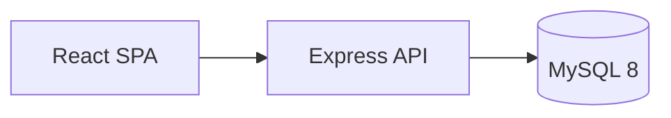
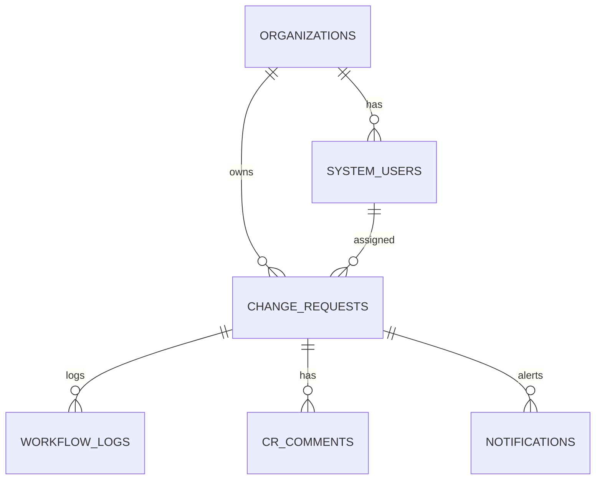

# Swipetouch CRMS — Technical Documentation

**Version:** 1.0 MVP  
**Project:** Change Request Management System  
**Stack:** React 18 · Node.js/Express · Prisma · MySQL 8

---

## Document index

| # | Document | Contents |
|---|----------|----------|
| — | [Overview](./technical/00-OVERVIEW.md) | Quick reference, doc map |
| 1 | [Requirements](./technical/01-REQUIREMENTS.md) | Functional & non-functional requirements, user stories, traceability |
| 2 | [ER Diagram](./technical/02-ER-DIAGRAM.md) | Entity-relationship model, tables, keys, indexes |
| 3 | [Data Flow Diagram](./technical/03-DATA-FLOW-DIAGRAM.md) | Context, Level-0/1/2 DFDs, process flows |
| 4 | [System Architecture](./technical/04-SYSTEM-ARCHITECTURE.md) | Components, API catalogue, security, deployment |
| 5 | [Access & Usability](./technical/05-ACCESS-AND-USABILITY.md) | Install, login, navigation, role guides |

---

## Executive summary

Swipetouch CRMS is a multi-tenant change request platform connecting **client institutions** (schools/colleges) with **Swipetouch internal teams** (approvers, CS staff, administrators). Clients submit customization requests; approvers gate and assign work; staff execute and resolve; administrators manage the system.

### Key capabilities

- Multi-role JWT authentication with organization-scoped client access
- Full CR lifecycle: submit → approve → assign → progress → resolve → close
- Return-to-admin and reassignment for misassigned tickets
- Internal vs client-visible comments
- JIRA/osTicket reference links
- Real-time-style notifications (30s polling)
- Role dashboards with charts and SLA tracking
- Reports with per-school drill-down
- CR list search, sort, and XLS export

### Architecture at a glance



### User roles

| Role | Portal |
|------|--------|
| CLIENT | Submit & track CRs for their institution |
| APPROVER | Approve, assign, reassign, close |
| CS_MEMBER | Execute assigned work |
| ADMIN | Full management + reporting |

---

## Quick access (development)

```bash
cp .env.example .env
docker compose up -d
npm install && npm run db:push && npm run db:seed
npm run dev:all
```

| URL | Service |
|-----|---------|
| http://localhost:3000 | Web app |
| http://localhost:3002/api/health | API |
| http://localhost:8081 | Adminer |

**Demo login:** `admin@swipetouch.local` / `demo123`

---

## ER diagram (summary)

See [full ER documentation](./technical/02-ER-DIAGRAM.md).



**7 tables:** `organizations`, `system_users`, `change_requests`, `workflow_logs`, `cr_comments`, `external_ticket_links`, `notifications`

---

## DFD (summary)

See [full DFD documentation](./technical/03-DATA-FLOW-DIAGRAM.md).

**Level-0:** Clients and Swipetouch staff interact with CRMS; external JIRA/osTicket referenced by link.

**Level-1 processes:**
1. Authentication & Session
2. Organization & User Management
3. Change Request Lifecycle
4. Comments & External Links
5. Notifications
6. Dashboard & Reporting

---

## Requirements (summary)

See [full requirements](./technical/01-REQUIREMENTS.md).

| Category | Count (Must-have) |
|----------|-------------------|
| Authentication | 5 |
| Organizations | 4 |
| Users | 3 |
| Change requests | 11 |
| Comments & tickets | 3 |
| Notifications | 4 |
| Dashboards & reports | 6 |
| List features | 4 |

**Out of scope (Phase 2):** attachments, WhatsApp, AI categorization, multi-level approval, SSO.

---

## Related documentation

- [Design docs (PRD, workflow rules)](../design/00-INDEX.md)
- [MySQL import script](../sql/README.md)
- [Project README](../../README.md)

---

## Diagram rendering note

All diagrams use **Mermaid** syntax. They render automatically on GitHub, GitLab, and many Markdown viewers (VS Code, Cursor). For PDF export, use a Mermaid-capable converter or [mermaid.live](https://mermaid.live).
