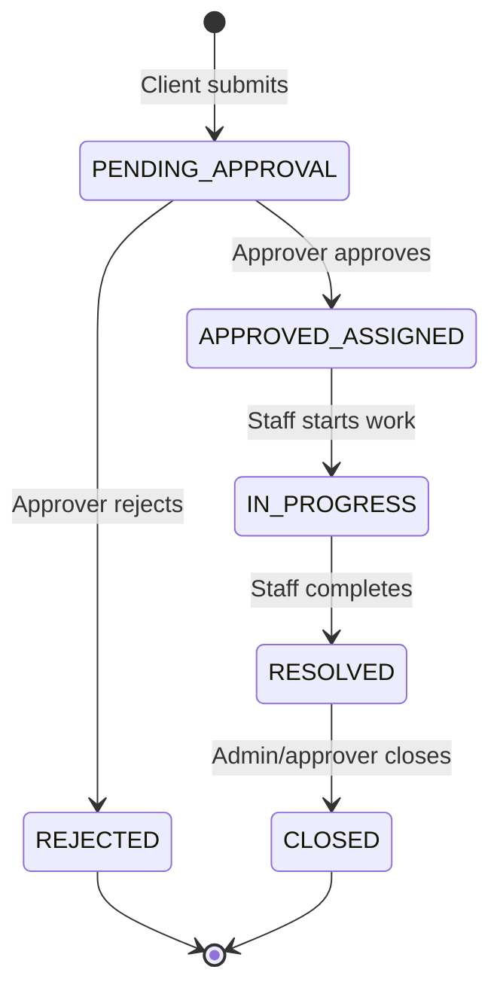

# Change Request Workflow

## Comment visibility

| Visibility | Visible to |
|------------|------------|
| `INTERNAL` | ADMIN, APPROVER, CS_MEMBER |
| `CLIENT_VISIBLE` | Above + CLIENT users of the same organization |

Only the original CR context is shown to clients; internal staff notes stay private.

## Assignment

1. Approver approves a pending CR
2. Approver (or admin) assigns an onboarded `CS_MEMBER`
3. Assigned staff updates status and adds comments / external ticket links
