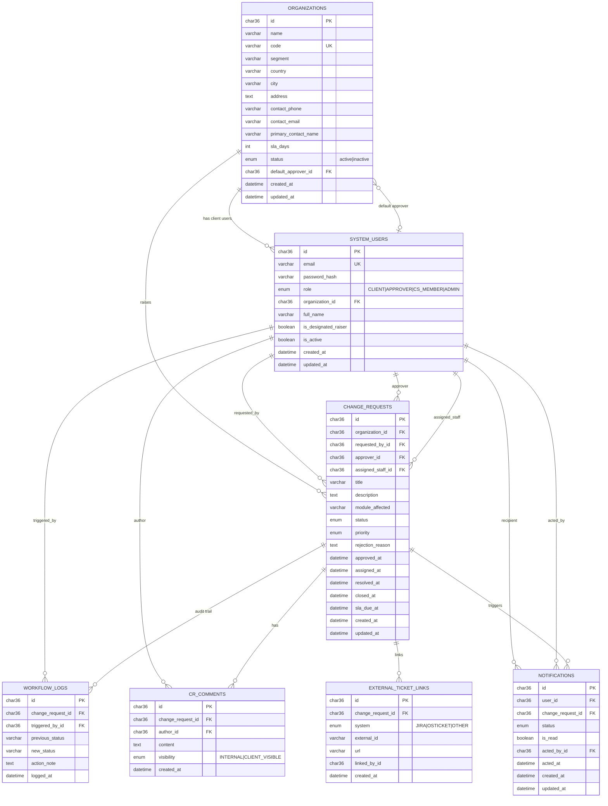
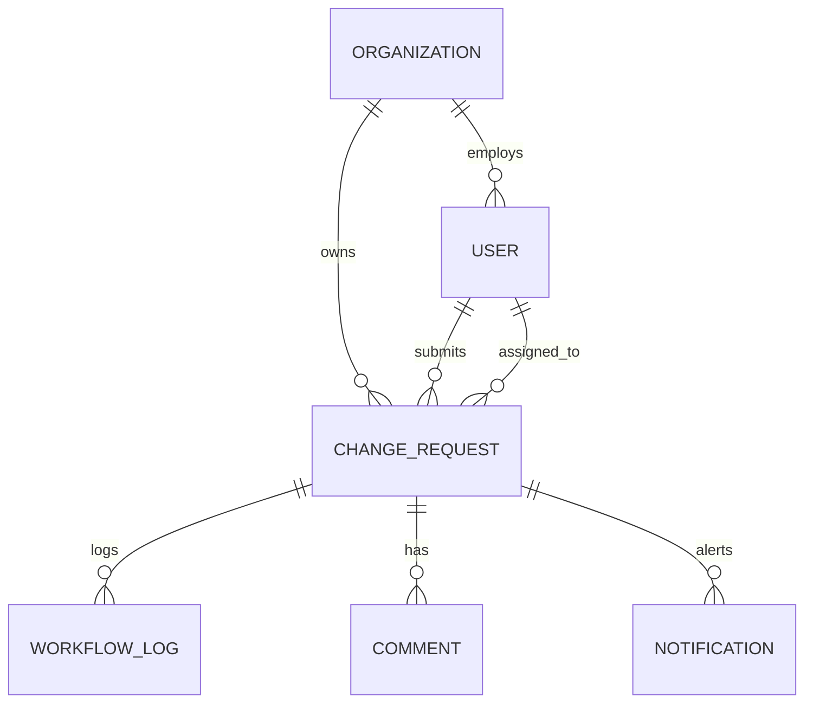

# Entity-Relationship Diagram

**Schema source:** `apps/api/prisma/schema.prisma`  
**Database:** MySQL 8, InnoDB, `utf8mb4_unicode_ci`

---

## 1. ER diagram (conceptual)

---

## 2. Entity descriptions

### organizations

Represents a client institution (school, college). The `code` field is used at client login together with email.

| Column | Description |
|--------|-------------|
| `sla_days` | Default SLA window for new CRs (days from creation) |
| `default_approver_id` | Optional link to approver user |
| `status` | `active` institutions can raise CRs |

### system_users

All login accounts. Internal users have `organization_id = NULL`. Client users belong to one organization.

| Column | Description |
|--------|-------------|
| `is_designated_raiser` | Only `true` client users may submit new CRs |
| `role` | Determines portal access and API permissions |

### change_requests

Master ledger of all change requests.

| Status enum | Meaning |
|-------------|---------|
| `PENDING_APPROVAL` | Awaiting approver decision |
| `APPROVED_ASSIGNED` | Approved; may have assignee or be in unassigned pool |
| `IN_PROGRESS` | Staff actively working |
| `RESOLVED` | Work done; awaiting close |
| `REJECTED` | Terminal — rejected by approver |
| `CLOSED` | Terminal — formally closed |

| Priority enum | Values |
|---------------|--------|
| `priority` | LOW, MEDIUM, HIGH, URGENT |

### workflow_logs

Append-only audit of every status transition. `action_note` captures rejection reasons, return-to-admin notes, reassignment context.

### cr_comments

Discussion thread on a CR. Visibility enforced at API and UI layer.

### external_ticket_links

Reference to JIRA, osTicket, or other external systems — not a live sync.

### notifications

Per-user inbox tied to a CR. Status drives UI labels (pending, approved, returned, assigned).

| Notification status | Meaning |
|---------------------|---------|
| `PENDING_APPROVAL` | CR awaiting approver action |
| `APPROVED` | CR was approved (inbox resolved) |
| `REJECTED` | CR was rejected |
| `RETURNED_FOR_REASSIGN` | Staff returned CR; admin must reassign |
| `ASSIGNED` | CR assigned/reassigned to this staff member |

**Unique constraint:** `(user_id, change_request_id)` — one notification row per user per CR.

---

## 3. Relationship cardinality

| From | To | Cardinality | On delete |
|------|-----|-------------|-----------|
| Organization | User (clients) | 1:N | SET NULL |
| Organization | ChangeRequest | 1:N | RESTRICT |
| User | ChangeRequest (requested) | 1:N | RESTRICT |
| User | ChangeRequest (assigned) | 1:N | SET NULL |
| ChangeRequest | WorkflowLog | 1:N | CASCADE |
| ChangeRequest | CrComment | 1:N | CASCADE |
| ChangeRequest | Notification | 1:N | CASCADE |
| User | Notification | 1:N | CASCADE |

---

## 4. Indexes (performance)

| Table | Index | Purpose |
|-------|-------|---------|
| `change_requests` | `(organization_id, created_at)` | Client history, reports |
| `change_requests` | `(status)` | Queue dashboards |
| `change_requests` | `(assigned_staff_id, status)` | Staff workload |
| `workflow_logs` | `(change_request_id, logged_at)` | Timeline display |
| `notifications` | `(user_id, status, is_read)` | Bell badge count |
| `system_users` | `(role, is_active)` | Staff picker, notifications |

---

## 5. Physical table map

Prisma `@map` names (MySQL table names):

| Prisma model | MySQL table |
|--------------|-------------|
| Organization | `organizations` |
| User | `system_users` |
| ChangeRequest | `change_requests` |
| WorkflowLog | `workflow_logs` |
| CrComment | `cr_comments` |
| ExternalTicketLink | `external_ticket_links` |
| Notification | `notifications` |

Full DDL + demo data: [`docs/sql/crms-full-import.sql`](../sql/crms-full-import.sql)

---

## 6. ER diagram (simplified — core entities only)

