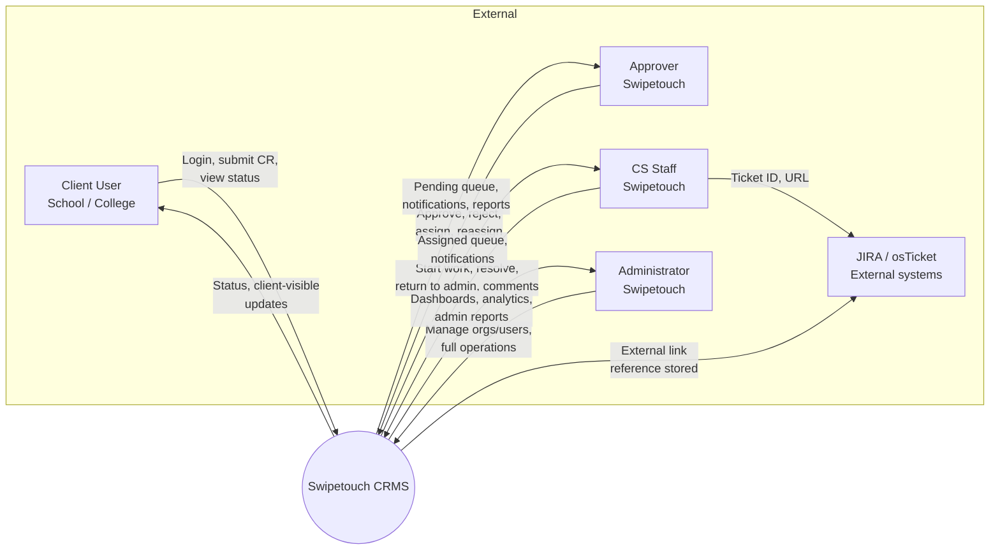
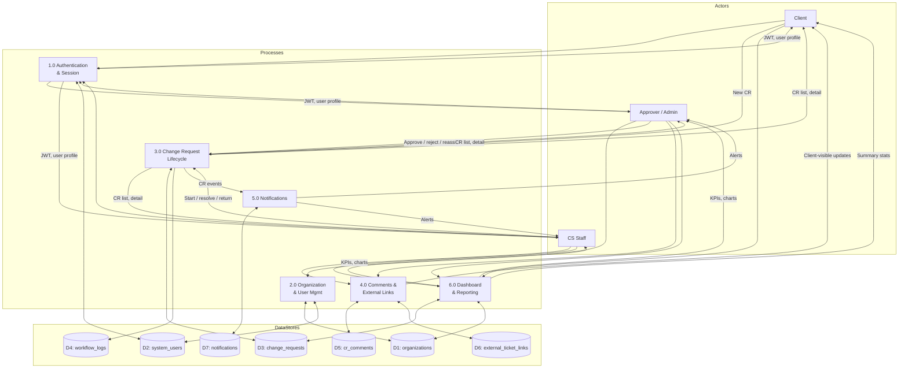
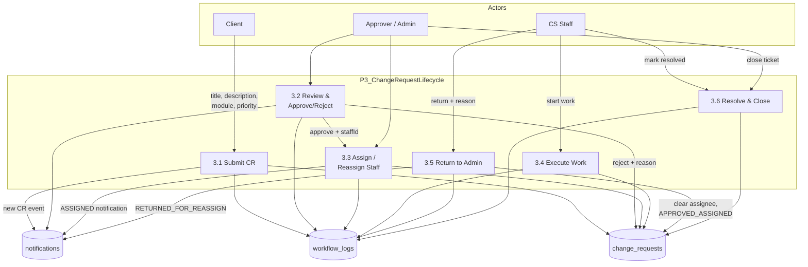
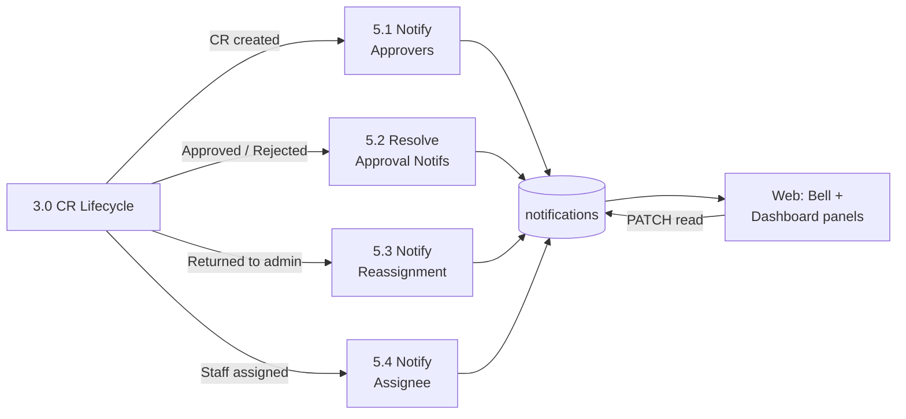
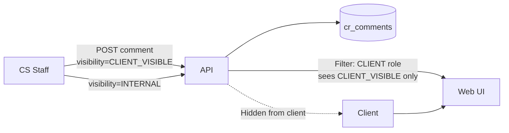
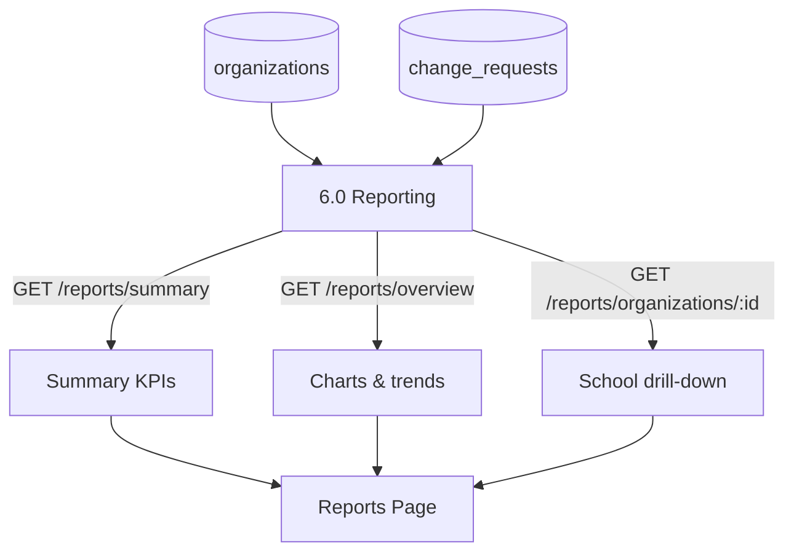

# Data Flow Diagram (DFD)

This document describes how data moves through the Swipetouch CRMS at context, Level-0, Level-1, and Level-2 (change request workflow).

**Notation:**
- **External entity** — actor outside the system (rectangle in classic DFD; shown as labeled nodes in Mermaid)
- **Process** — transformation (rounded box)
- **Data store** — persistent storage (database tables)
- **Data flow** — labeled arrow

---

## 1. Context diagram (Level 0)

Shows CRMS as a single system and its interactions with external actors.

### External entities

| Entity | Description |
|--------|-------------|
| **Client User** | Designated CR raiser at an institution |
| **Approver** | Reviews and approves incoming CRs |
| **CS Staff** | Executes approved work |
| **Administrator** | System and institution management |
| **JIRA / osTicket** | External ticket systems (reference links only) |

---

## 2. Level-1 DFD — major processes

Decomposes CRMS into primary functional processes and data stores.

### Process catalogue

| Process | Description | Primary data stores |
|---------|-------------|---------------------|
| **1.0 Authentication** | Login, JWT issue, `/me` profile | D2 |
| **2.0 Organization & User Mgmt** | CRUD institutions, users, raisers | D1, D2 |
| **3.0 Change Request Lifecycle** | Submit, transition, return, reassign | D3, D4 |
| **4.0 Comments & External Links** | Internal/client comments, JIRA links | D5, D6 |
| **5.0 Notifications** | Create, resolve, read notifications | D7 |
| **6.0 Dashboard & Reporting** | Aggregations, charts, exports | D1, D3 |

---

## 3. Level-2 DFD — Process 3.0 Change Request Lifecycle

Detailed flow for the core CR workflow.

### Status transitions (data written to D3)

| From | To | Triggered by | Data updated |
|------|-----|--------------|--------------|
| — | `PENDING_APPROVAL` | Client submit | `requested_by_id`, `sla_due_at`, `created_at` |
| `PENDING_APPROVAL` | `APPROVED_ASSIGNED` | Approve | `approver_id`, `assigned_staff_id`, `approved_at`, `assigned_at` |
| `PENDING_APPROVAL` | `REJECTED` | Reject | `rejection_reason`, `approver_id` |
| `APPROVED_ASSIGNED` | `IN_PROGRESS` | Staff start | `status` |
| `IN_PROGRESS` / `APPROVED_ASSIGNED` | `APPROVED_ASSIGNED` (unassigned) | Return to admin | `assigned_staff_id = NULL` |
| `APPROVED_ASSIGNED` | `APPROVED_ASSIGNED` (new assignee) | Reassign | `assigned_staff_id`, `assigned_at` |
| `IN_PROGRESS` | `RESOLVED` | Staff resolve | `resolved_at` |
| `RESOLVED` | `CLOSED` | Approver/admin close | `closed_at` |

Every transition appends one row to **D4 (workflow_logs)**.

---

## 4. Level-2 DFD — Process 5.0 Notifications

| Event | Recipients | Notification status |
|-------|------------|---------------------|
| CR submitted | ADMIN, APPROVER | `PENDING_APPROVAL` |
| CR approved | ADMIN, APPROVER (update) | `APPROVED` |
| CR rejected | ADMIN, APPROVER (update) | `REJECTED` |
| CR returned by staff | ADMIN, APPROVER | `RETURNED_FOR_REASSIGN` |
| CR assigned/reassigned | Target CS_MEMBER | `ASSIGNED` |

---

## 5. Data flow — client comment visibility

---

## 6. Data flow — reporting pipeline

Aggregations computed at request time from MySQL — no separate analytics warehouse in MVP.

---

## 7. DFD ↔ API mapping

| DFD process | Primary API endpoints |
|-------------|----------------------|
| 1.0 Auth | `POST /api/auth/login`, `GET /api/auth/me` |
| 2.0 Org/Users | `/api/organizations/*`, `/api/users/*` |
| 3.0 CR Lifecycle | `/api/change-requests/*` |
| 4.0 Comments/Links | `POST .../comments`, `POST .../external-tickets` |
| 5.0 Notifications | `/api/notifications/*` |
| 6.0 Dashboard/Reports | `/api/dashboard/*`, `/api/reports/*` |
