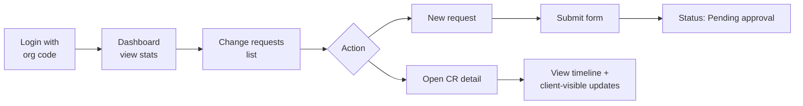
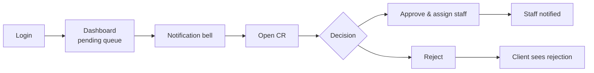
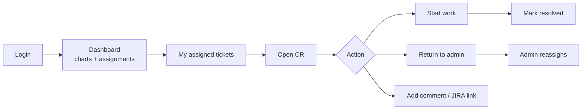

# Access & Usability Guide

This guide explains how to install, access, and use the Swipetouch CRMS for each user role.

---

## 1. System access URLs

### Local development

| Service | URL | Purpose |
|---------|-----|---------|
| **Web application** | http://localhost:3000 | Main user interface |
| **API** | http://localhost:3002/api | REST backend |
| **API health check** | http://localhost:3002/api/health | Verify API is running |
| **Adminer (DB UI)** | http://localhost:8081 | Browse MySQL database |
| **MySQL** | `localhost:3307` | Direct DB connection |

### Production (typical)

| Service | URL pattern |
|---------|-------------|
| Web | `https://your-domain.com` |
| API | `https://your-domain.com/api` |

---

## 2. Installation & first run

### Prerequisites

- Node.js 18+
- Docker Desktop (for local MySQL) **or** existing MySQL 8 server
- npm 9+

### Steps

```bash
# 1. Clone and enter project
cd Swift_CRTool

# 2. Environment
cp .env.example .env

# 3. Start MySQL (Docker)
docker compose up -d

# 4. Install dependencies
npm install

# 5. Create database schema
npm run db:push

# 6. Load demo data (choose one)
npm run db:seed
# OR import SQL file:
# docker compose exec -T mysql mysql -uroot -pcrms_dev_root < docs/sql/crms-full-import.sql

# 7. Start application
npm run dev:all
```

Open **http://localhost:3000** in your browser.

### Verify installation

1. Visit http://localhost:3002/api/health — should return `{"status":"ok"}`
2. Log in as admin (see credentials below)
3. Dashboard should show KPI cards and charts

---

## 3. Login credentials (demo)

**Password for all accounts:** `demo123`

### Swipetouch internal (no organization code)

| Role | Email | What you can do |
|------|-------|-----------------|
| **Administrator** | `admin@swipetouch.local` | Full system access |
| **Approver** | `approver@swipetouch.local` | Approvals, assign staff, reports |
| **CS Staff 1** | `staff1@swipetouch.local` | Work assigned tickets |
| **CS Staff 2** | `staff2@swipetouch.local` | Work assigned tickets |

### Client portals (organization code required)

| Institution | Org code | Email | Name |
|-------------|----------|-------|------|
| Demo Public School | `demoschool` | `client@demoschool.local` | Rajesh Verma |
| Demo Public School | `demoschool` | `client2@demoschool.local` | Anita Singh |
| Green Valley Intl. School | `greenvalley` | `admin@greenvalley.edu.in` | Meera Iyer |
| Green Valley Intl. School | `greenvalley` | `it@greenvalley.edu.in` | Karthik Nair |
| St. Mary's College | `stmarys` | `cr@stmarys.edu.in` | Sister Maria Joseph |
| DAV College of Management | `davcollege` | `office@davcm.edu.in` | Dr. Sandeep Khurana |
| DAV College of Management | `davcollege` | `registrar@davcm.edu.in` | Pooja Bansal |
| Sunrise Academy | `sunrise` | `hello@sunriseacademy.in` | Vikram Deshpande |

### Login screen fields

| User type | Fields |
|-----------|--------|
| Internal (admin, approver, staff) | Email + Password |
| Client | Organization code + Email + Password |

---

## 4. Navigation map

After login, the left sidebar shows role-specific menu items:

| Menu item | Visible to | Description |
|-----------|------------|-------------|
| **Dashboard** | All | Home page with KPIs and charts |
| **Change requests** / **My change requests** | All | Searchable CR list |
| **Pending approvals** | Approver, Admin | Queue of CRs awaiting decision |
| **Administration → Institutions** | Approver, Admin | School/college profiles |
| **Administration → Users & staff** | Admin only | Internal user management |
| **Reports** | Approver, Admin | Analytics and school drill-down |

**Header:** Notification bell (approver, admin, staff) · Profile name · Sign out

---

## 5. Role-based user guides

### 5.1 Client user journey



**Step-by-step: Submit a change request**

1. Log in with org code, email, and password
2. Go to **Change requests** → click **New request**
3. Fill in: Title, Description, Module, Priority
4. Submit — CR appears as **Pending approval**
5. Track progress on Dashboard or CR detail page

**What clients can see:**
- Their organization's CRs only
- Status timeline
- Comments marked **Visible to client**
- Cannot see internal staff notes

---

### 5.2 Approver user journey



**Step-by-step: Approve and assign**

1. Log in as `approver@swipetouch.local`
2. Check **notification bell** or **Pending approvals** menu
3. Open a CR in `Pending approval` status
4. Click **Approve & assign** → select CS staff member → optional note
5. Staff receives assignment notification

**Step-by-step: Reassign returned ticket**

1. Open notification **Needs reassignment** (orange tag)
2. On CR detail, click **Assign staff** or **Reassign staff**
3. Select correct SME and add context note
4. New assignee is notified

---

### 5.3 CS Staff user journey



**Step-by-step: Work a ticket**

1. Log in as `staff1@swipetouch.local`
2. Dashboard shows queue charts and **Assignments & updates** panel
3. Open assigned CR → click **Start work** (if awaiting start)
4. Add internal or client-visible comments
5. Link JIRA ticket under **External tickets**
6. Click **Mark resolved** when done

**Step-by-step: Return wrongly assigned ticket**

1. Open CR assigned to you
2. Click **Return to admin** (red button)
3. Enter reason (e.g. "Requires Finance module expertise")
4. Ticket moves to unassigned pool; admin is notified

---

### 5.4 Administrator user journey

**Institution onboarding**

1. **Administration → Institutions** → **Add institution**
2. Enter profile: name, code, address, contacts, SLA days
3. Configure two designated CR raisers with emails and passwords
4. Save — clients can log in immediately with org code

**User management**

1. **Administration → Users & staff** → **Add user**
2. Select role (ADMIN, APPROVER, CS_MEMBER)
3. Set email, name, password

**Operations overview**

1. **Dashboard** — KPI strip, status pie chart, top clients, SLA health, pending queue
2. **Reports** — cross-institution analytics, drill into any school
3. **Change requests** — full list with search, sort, export XLS

---

## 6. Change request list features

Available on **Change requests** page (all internal roles + clients see scoped list):

| Feature | How to use |
|---------|------------|
| **Search** | Type in search box — matches title, module, client name |
| **Status filter** | Dropdown to filter by CR status |
| **Sort** | Choose field (updated, title, status, etc.) and ascending/descending |
| **Export XLS** | Click **Export XLS** — downloads current filtered results |
| **My queue** | Staff: use link from dashboard or `?assignedToMe=true` URL |
| **Open detail** | Click any row |

---

## 7. Dashboard features by role

| Role | Dashboard contents |
|------|-------------------|
| **CLIENT** | Pending, in progress, resolved, total CR counts |
| **CS_MEMBER** | KPI cards, status/module/priority charts, assignment panel, quick links |
| **APPROVER / ADMIN** | 6 KPI metrics, status pie, top clients bar chart, compact pending queue, SLA health, quick links |

**Admin dashboard period toggle:** 1M / 3M / 6M affects completed/raised metrics and charts.

---

## 8. Reports module

Path: **Reports** (approver and admin only)

| Section | Content |
|---------|---------|
| Summary cards | Total CRs, open, closed, avg resolution time |
| Charts | Status breakdown, module distribution, trends |
| Schools grid | Searchable, sortable list of all institutions |
| School drill-down | Click a school → `/reports/schools/:id` for per-school CR grid |

---

## 9. Database access (developers / admins)

### Via Adminer (local)

1. Open http://localhost:8081
2. System: **MySQL**
3. Server: `mysql` (inside Docker network) or `host.docker.internal` / `127.0.0.1:3307` from host
4. Username: `crms` / Password: `crms_dev` / Database: `crms`

### Via MySQL CLI

```bash
docker compose exec mysql mysql -ucrms -pcrms_dev crms
```

### Full import on a new server

```bash
mysql -u root -p < docs/sql/crms-full-import.sql
```

See [docs/sql/README.md](../sql/README.md) for details.

---

## 10. Troubleshooting

| Issue | Solution |
|-------|----------|
| Cannot log in | Verify password `demo123`; clients must enter correct org code |
| API errors / blank pages | Check API running at :3002; run `npm run dev:all` |
| Database connection failed | Ensure Docker MySQL is up: `docker compose ps` |
| Port 3307 in use | Change port in `docker-compose.yml` and `DATABASE_URL` |
| No notifications | Approver/admin/staff only; refresh or wait 30s for poll |
| Export XLS empty | Load CR list first; export uses current filtered rows |

---

## 11. Usability principles applied

| Principle | Implementation |
|-----------|----------------|
| Role-based UI | Menu and actions adapt to logged-in role |
| Minimal clicks to act | Approve, assign, return from CR detail page |
| Visual status | Color-coded tags for CR status and priority |
| At-a-glance operations | Dashboard KPIs and charts before diving into lists |
| Feedback | Toast messages on actions; notification bell for async events |
| Data portability | XLS export on CR list |
| Safe client isolation | Clients never see other schools' data or internal notes |

---

## 12. Keyboard & browser support

- **Supported browsers:** Chrome, Firefox, Safari, Edge (latest two versions)
- **Responsive layout:** Sidebar collapses on smaller screens; usable on tablet
- **Recommended resolution:** 1280×720 or wider for dashboard charts
